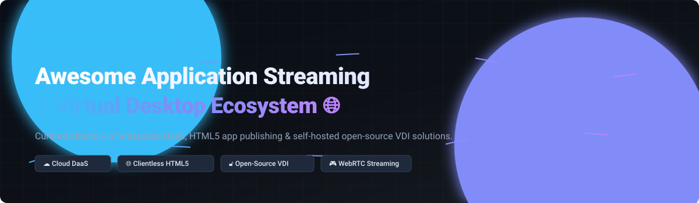

# Awesome-Application-Streaming-Virtual-Desktop 🖥️ 🌐 ⚡

  

  
  
  
  
  
  

---

## 🌟 Top Application Streaming & Virtual Desktop Ecosystem 🖥️ 🚀

**Curated List of Commercial DaaS & Application Publishing Platforms with Open-Source VDI, Remote Desktop Gateways & WebRTC Streaming Solutions**  
*Focused on Desktop as a Service (DaaS), Application Publishing, Clientless HTML5 Web Access, Self-Hosted Virtualization & WebRTC Low-Latency Desktop Delivery*  

**Last updated: October 2026** 📅

---

### 📌 Overview & SEO Summary 🔍
Welcome to the definitive curated directory of **application streaming platforms**, **Virtual Desktop Infrastructure (VDI) solutions**, **clientless remote desktop gateways**, and **low-latency WebRTC desktop streaming tools**. As cloud computing, remote work, and hybrid digital workspaces evolve, organizations rely heavily on Desktop as a Service (DaaS) and open-source VDI alternatives to deliver secure, browser-accessible compute environments.

According to IDC MarketScape research, cloud hyperscalers (Microsoft Azure Virtual Desktop, AWS AppStream 2.0) and enterprise virtualization platforms (Citrix DaaS, Omnissa Horizon) lead commercial desktop delivery. Concurrently, high-performance open-source projects such as **RustDesk**, **Sunshine**, **noVNC**, **FreeRDP**, **Apache Guacamole**, and **Kasm Workspaces** empower developers and system administrators to deploy sovereign, self-hosted virtual desktop environments with zero vendor lock-in.

---

## 📑 Table of Contents 📜
- [🏢 SaaS & Commercial Platforms](#-saas--commercial-platforms)
- [🔓 Open-Source GitHub Projects](#-open-source-github-projects)
- [🛠️ How to Contribute](#%EF%B8%8F-how-to-contribute)
- [📊 Star History](#-star-history)
- [🤝 Support & Sponsorship](#-support--sponsorship)
- [⚠️ Disclaimer](#%EF%B8%8F-disclaimer)

---

## 🏢 SaaS / Commercial Platforms 💼

> [!NOTE]
> **Market Overview & Sector Dynamics:** The Desktop as a Service (DaaS) market is valued at approximately **$4.3 Billion (2025)** and projected to exceed **$6.0 Billion by 2029**, with the broader VDI ecosystem exceeding **$20 Billion**. The sector is **moderately fragmented**, undergoing rapid transition from legacy on-premises virtualization to cloud-native delivery dominated by hyperscalers (Microsoft, Google/Cameyo, AWS) alongside enterprise VDI leaders (Citrix, Omnissa, Nutanix) and agile niche providers.

| SaaS / Commercial Platform | Company / Owner | Company Size / Valuation | Starting Price | Free Tier / Free Trial Limits | Description |
| :--- | :--- | :--- | :--- | :--- | :--- |
| **[Microsoft Azure Virtual Desktop](https://azure.microsoft.com/en-us/products/virtual-desktop/)** 🔷 | Microsoft | ~$3.90 Trillion (Market Cap) | $5.40/user/month (access fee + consumption) | 30-day free trial with $200 Azure credits + 12 months free select services | **Cloud VDI on Azure** — Multi-session Windows, native Entra ID integration, and flexible scaling. IDC MarketScape Leader for DaaS in 2026 [citation:1]. Best for Microsoft-first organizations [citation:6]. |
| **[Cameyo](https://cameyo.com/)** 📦 | Google (Alphabet) | ~$2.30 Trillion (Market Cap) | $12.00/user/month | Free plan for up to 3 users; 14-day full trial for enterprise plans | **Application virtualization** — Publishes Windows apps to browsers without VDI. Acquired by Google in 2024 for ChromeOS integration. |
| **[Amazon AppStream 2.0](https://aws.amazon.com/appstream2/)** ☁️ | Amazon (AWS) | ~$2.10 Trillion (Market Cap) | $0.10/hour per instance + $4.19/user/month | 40 hours/month free trial of `stream.standard.regular` instance for 2 months | **Fully managed application streaming** — Delivers desktop apps to any HTML5 browser. Elastic scalability, no infrastructure management. AWS-recommended for ISVs delivering applications via the cloud [citation:6]. |
| **[Citrix DaaS](https://www.citrix.com/)** 🏢 | Cloud Software Group | $16.50 Billion (Valuation) | $10.00/user/month | 15-day free trial supporting up to 25 user accounts | **Enterprise DaaS and app delivery** — Hybrid and multi-cloud VDI, application publishing, and Workspace access layer. IDC MarketScape Leader. Many organizations use Citrix primarily for app publishing rather than full VDI [citation:6]. |
| **[Nutanix Frame](https://www.nutanix.com/products/frame)** 🖼️ | Nutanix | $15.00 Billion (Market Cap) | $20.00/user/month (or $0.15/user/hour) | 30-day free trial with up to 5 concurrent test sessions | **Cloud-native DaaS** — Runs on AWS, Azure, or Nutanix AHV. Browser-based access, GPU support, and application publishing. |
| **[Omnissa Horizon Cloud](https://www.omnissa.com/)** 🔮 | Omnissa (KKR) | $4.00 Billion (Valuation) | $8.25/user/month | 30-day free trial supporting up to 100 user seats | **Enterprise VDI platform** — Formerly VMware Horizon. Mature virtualization features, hybrid deployment options, strong scalability. IDC MarketScape Leader for DaaS in 2026 [citation:1]. |
| **[Parallels RAS](https://www.parallels.com/products/ras/)** ⚡ | Parallels (Alludo / Vector Capital) | $4.00 Billion (Vector AUM) | $6.67/user/month ($80/user/year) | 30-day full-featured free trial up to 50 concurrent user licenses | **Application and desktop delivery** — Simpler alternative to Citrix with strong application publishing. Azure integration and multi-cloud support. IDC MarketScape Leader for DaaS in 2026 [citation:1]. |
| **[Workspot](https://www.workspot.com/)** 🛠️ | Workspot | $500 Million (Valuation) | $15.00/user/month ($180/user/year) | 30-day proof-of-concept free trial upon request | **Cloud-native VDI** — Enterprise-grade desktop delivery with multi-cloud support. Positioned in IDC MarketScape Capabilities quadrant [citation:1]. |
| **[Kasm Workspaces](https://kasm.com/)** 🐳 | Kasm Technologies | $50 Million (Valuation) | $5.00/user/month ($60/user/year) | **Community Edition free forever** (up to 5 concurrent sessions); 14-day trial for enterprise | **Containerized workspace streaming** — Open-source web-native rendering. Delivers Docker-based desktops and apps via browser. Images and streaming technology open-source [citation:5][citation:14]. |
| **[Apporto](https://apporto.com/)** 🍎 | Apporto | $25 Million (Valuation) | $8.33/user/month ($99/user/year) | 14-day interactive free demo environment | **Cloud desktop for education** — Browser-based virtual labs and application delivery focused on universities and colleges. |

---

## 🔓 Open-Source GitHub Projects 🌐

*Sorted by GitHub Star Count (Descending)* 🌟

- **[RustDesk](https://github.com/rustdesk/rustdesk)**   
  **Open-source virtual desktop & remote access software**, AGPL-3.0 licensed. ~70k+ stars. Full control of your data with self-hosted relay/rendezvous server options. Cross-platform support for Windows, macOS, Linux, Android, and iOS. 🦀

- **[Sunshine](https://github.com/SunshineStream/Sunshine)**   
  **Self-hosted WebRTC game & desktop stream host**, GPL-3.0 licensed. ~18k+ stars. Offers low-latency cloud desktop and application streaming for Moonlight clients with hardware encoding support for NVENC, AMD AMF, and Intel QuickSync. ☀️

- **[noVNC](https://github.com/novnc/noVNC)**   
  **HTML5 VNC client library**, MPL-2.0 licensed. ~11k+ stars. Enables clientless browser-based remote desktop access using WebSockets and Canvas HTML5 APIs. Standard component in cloud VDI and hypervisor management dashboards. 🖥️

- **[FreeRDP](https://github.com/FreeRDP/FreeRDP)**   
  **Free Remote Desktop Protocol (RDP) implementation**, Apache-2.0 licensed. ~10k+ stars. Cross-platform RDP client and server core library powering high-performance Linux VDI deployments and clientless remote portals. 💻

- **[Apache Guacamole](https://github.com/apache/guacamole-server)**   
  **Clientless remote desktop gateway**, Apache-2.0 licensed. ~3.5k+ stars. Supports standard protocols (VNC, RDP, SSH) through any HTML5 web browser without plugins. Active community with enterprise support integrations [citation:4][citation:9][citation:18]. 🥑

- **[Selkies-GStreamer](https://github.com/selkies-project/selkies-gstreamer)**   
  **Low-latency Linux WebRTC HTML5 remote desktop**, MPL-2.0 licensed. ~2k+ stars. GPU/CPU-accelerated streaming at 60 FPS Full HD. Designed for containers, Kubernetes, and HPC environments [citation:12][citation:17]. 🎮

- **[Kasm Workspaces Images](https://github.com/kasmtech/workspaces-images)**   
  **Containerized desktop and application streaming**, Community Edition free. ~2k+ stars. Web-native rendering technology delivers Docker-based workspaces. All core images and streaming tech open-source on Docker Hub and GitHub [citation:5][citation:14]. 🐳

- **[OpenUDS](https://github.com/VirtualCable/openuds)**   
  **Multiplatform VDI connection broker**, AGPL-3.0 licensed. ~300 stars. Open-source multiplatform connection broker managing access to virtual desktops, apps, and terminal servers across multiple hypervisors [citation:16]. 🔗

- **[Ravada](https://github.com/UPC/ravada)**   
  **Remote virtual desktops manager**, AGPL-3.0 licensed. ~220 stars. KVM-based VDI management infrastructure with user-friendly web interface for small and medium deployments [citation:16]. 🎯

- **[IsardVDI](https://gitlab.com/isard/isardvdi)**   
  **Open-source KVM virtual desktop infrastructure**, AGPL-3.0 licensed. ~193 stars. GPU pass-through (NVIDIA Grid), Docker-based deployment, and SPICE/noVNC viewers [citation:7][citation:11][citation:16]. 🖥️

- **[QVD](https://github.com/qindel/qvd)**   
  **Open-source Linux VDI solution**, GPL-3.0 licensed. ~104 stars. Developed by Qindel Group for secure, scalable Linux virtual desktop publishing [citation:16]. ⚙️

- **[a-da](https://github.com/SpringStudent/a-da)**   
  **Distributed remote desktop control system**, MIT licensed. ~60 stars. JavaCV + Netty + Swing based low-latency remote desktop control system [citation:8]. 🎛️

---

## 🛠️ How to Contribute 🤝

Contributions are warmly welcomed! Follow these simple steps to submit new application streaming platforms or open-source VDI tools:

1. 🍴 **Fork** this repository.
2. 📝 **Add/edit** entries in `README.md` maintaining table/list structure and formatting.
3. 🔗 Include project title, official website/GitHub link, exact star count, license, and concise description.
4. 🚀 Submit a **Pull Request** with a descriptive summary of your additions.

---

## 📊 Star History

---

## 🤝 Support & Sponsorship ☕

If you find this application streaming and virtual desktop resource helpful, please consider supporting the project:

- ⭐ **Star** this repository to increase visibility and help others discover open-source VDI solutions!
- 🔀 **Fork & Share** with fellow DevOps engineers, system administrators, and cloud architects.
- ☕ **Buy Me a Coffee & Sponsor**: Thank you for supporting open-source software curation! You can sponsor ongoing maintenance via the [GitHub Sponsor Dashboard](https://github.com/sponsors/ishandutta2007).

---

## ⚠️ Disclaimer ℹ️

- This is a **community-curated** list for educational and research purposes — not an official endorsement. ℹ️
- DaaS and VDI solutions process sensitive desktop sessions and enterprise data. **Review security architecture, zero-trust policies, data residency, and compliance certifications** prior to production deployment. 🔒
- Open-source platforms (RustDesk, Apache Guacamole, Kasm Workspaces, IsardVDI) provide full data ownership and transparency, whereas commercial DaaS offerings provide managed SLAs and 24/7 enterprise infrastructure support. 🖥️

---

  <b>Made with ❤️ for IT administrators, cloud architects, and open-source virtualization enthusiasts.</b>

